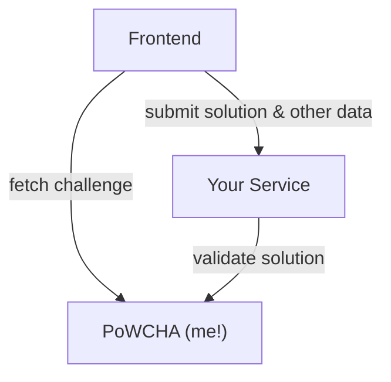

# PoWCHA

PoWCHA is a GDPR compliant, self-hosted CAPTCHA alternative.

PoWCHA is a PoW (proof-of-work) CAPTCHA that is designed to be a drop-in replacement for traditional CAPTCHAs. It is simple, lightweight, and privacy-focused, and easy to integrate into any web applications.

## Getting Started

Sorry for the inconvenience, but the documentation is still WIP.

Please start with the following files:

- Configuration: `config.yaml`
- API Routes: `router.go`
- Main handler: `biz/handler/common.go`

To start the server, execute the following commands:

```bash
go mod tidy
./build.sh
chmod +x ./output/bootstrap.sh
./output/bootstrap.sh
```

## Frontend Integration

We recommend using the [powcha-web](https://github.com/TundraWork/powcha-web) implementation for your frontend project.

## Backend Integration

A typical PoWCHA verification flow is as follows:



If you use the [powcha-web](https://github.com/TundraWork/powcha-web) implementation for frontend, you don't need to do anything for the `fetch challenge` part.

For the `submit solution` part, the [powcha-web](https://github.com/TundraWork/powcha-web) implementation will add a hidden input field to the form with the name `powcha` by default. The value is a base64 encoded string that contains the solution data. Your service should simply pass this value as the payload to the PoWCHA server, and that's it!

## License

This project is licensed under the MIT License - see the [LICENSE](LICENSE) file for details.